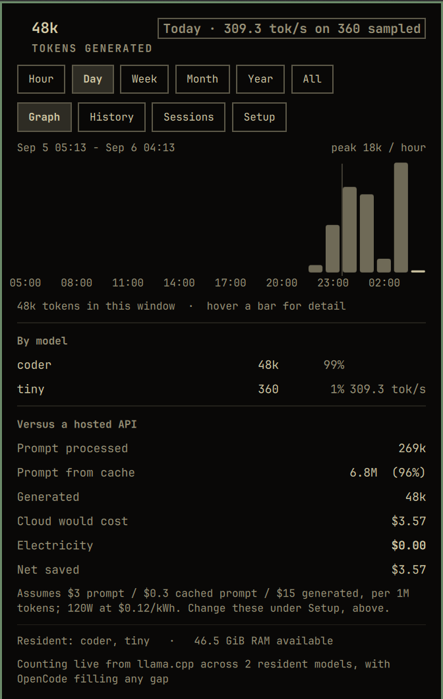

# Token Stats

Exact token counts from your local LLMs in the Omarchy bar, with a graph,
browsable history, and an honest comparison against what a hosted API would
have charged.



The bar carries **one number** — `TS: 8.2k tokens/hour` — because a bar widget
that grows a row of figures stops being glanceable. Everything else is a hover
or a click away.

- **Hover** — prompt tokens, generation rate, savings, RAM available, and which
  models are resident.
- **Click** — the panel: totals for any window, a bar graph, a history table,
  a sessions list, a per-model breakdown, and the savings arithmetic with its
  assumptions printed next to it.
- **Graph** — hover any bar and a readout follows the pointer with the exact
  weekday, date, time span and token count. The axis carries real dates, and a
  rule marks each day boundary.
- **Sessions** — your OpenCode sessions ranked by tokens generated, titled from
  what you actually asked for. **Click one to resume it** in a terminal, in its
  own working directory.
- **Honest about its source** — the panel names where the numbers come from, and
  what enabling llama.cpp metrics would add.
- **By model** — how many tokens each model produced, its share of the window,
  and its measured throughput where one was sampled.
- **Windows** — this hour (by minute), today (by hour), 7 days, 30 days,
  12 months, or everything still retained.

## Counts are exact, not estimated

Token counts come from llama.cpp's own Prometheus counters
(`llamacpp:prompt_tokens_total`, `llamacpp:prompt_tokens_cached_total`,
`llamacpp:tokens_predicted_total`), reached through llama-swap at
`/upstream/<model>/metrics`. They match the `usage` block of the API response
exactly — including the prompt, which needs both of the first two counters and
not just the obvious one. See [What the prompt figures
mean](#what-the-prompt-figures-mean).

The obvious alternative — estimating tokens from HTTP response size — is wrong
by more than an order of magnitude, because a streamed response is mostly SSE
framing rather than content. On the machine this was written for, that approach
implied 1,742 tok/s against a measured 46–50. There is deliberately no
bytes-per-token constant anywhere in this plugin.

## Requirements

Omarchy 4 (Quattro) with `omarchy-shell`, and a local model you actually run.

**It works with no configuration.** OpenCode records the provider's own usage
block for every reply, so the plugin counts exactly from those records out of
the box — no setup, no flags, nothing to enable.

### Optional: live counting from llama.cpp

Enabling llama.cpp's metrics endpoint adds two things: **live throughput**
(tokens per second, which OpenCode's records cannot provide) and coverage of
**clients other than OpenCode**.

Add `--metrics` to your llama-server arguments. In a llama-swap `config.yaml`
that uses a shared macro:

```yaml
macros:
  server: >
    /usr/bin/llama-server
    --host 127.0.0.1
    --port ${PORT}
    --metrics
```

Then `systemctl --user restart llama-swap`.

The panel always says which source it is using, so you never have to guess
whether this step took effect. The two sources run side by side, separated by a
per-model watermark — nothing is ever counted twice, and nothing is dropped
because the other source was assumed to have it.

### External dependencies

All of these ship with Omarchy; nothing is installed by the plugin, and nothing
runs as root.

| Command | Used for |
|---|---|
| `/usr/bin/curl` | Reading the llama-swap and llama.cpp endpoints over loopback |
| `/usr/bin/sqlite3` | Reading OpenCode's database, **read-only**, for backfill and the sessions list |
| `/usr/bin/mkdir` | Creating this plugin's own state directory on first run |
| `/usr/bin/omarchy-launch-tui` | Opening a terminal when you click a session (Omarchy's own launcher) |

The plugin never writes to OpenCode's database — it is opened with
`sqlite3 -readonly` against a `mode=ro` URI.

## Install

```bash
omarchy plugin add https://github.com/ErikBurdett/omarchy-tokenstats.git --enable
```

Or by hand:

```bash
git clone https://github.com/ErikBurdett/omarchy-tokenstats.git \
  ~/.config/omarchy/plugins/io.github.erikburdett.tokenstats
omarchy-shell shell rescanPlugins
omarchy plugin enable io.github.erikburdett.tokenstats left
```

## Remove

```bash
omarchy plugin disable io.github.erikburdett.tokenstats
omarchy plugin remove io.github.erikburdett.tokenstats --yes
rm -rf ~/.local/state/omarchy/tokenstats      # recorded history, if you want it gone
```

To take it off the bar but keep it installed, run only the `disable` line.

## Position

Defaults to the left section, and goes anywhere:

```bash
omarchy bar move io.github.erikburdett.tokenstats --section right
omarchy bar move io.github.erikburdett.tokenstats --after omarchy.clock
```

## Settings

In **Setup > Plugins > Token Stats**, or on the widget's entry in
`~/.config/omarchy/shell.json`.

| Setting | Default | What it does |
|---|---|---|
| Bar shows | `Today` | Window the per-hour rate is averaged over |
| Import history from OpenCode | `on` | Backfill exact counts from OpenCode's database |
| Refresh (seconds) | `10` | One loopback request per resident model per refresh |
| Cloud price per 1M prompt tokens | `3.00` | Set to the API you would otherwise use |
| Cloud price per 1M generated tokens | `15.00` | |
| Cloud price per 1M cached prompt tokens | `0.30` | Hosted APIs bill cache hits at a reduced rate, not free |
| System draw while generating (W) | `120` | Used to cost your own electricity |
| Electricity price per kWh | `0.12` | |
| Currency symbol | `$` | |
| llama-swap endpoint | `http://127.0.0.1:8080` | Loopback only; anything else is ignored |

The default cloud prices are a *stated assumption*, not a measurement — the
plugin cannot know which service you would otherwise have used. They are printed
on the panel next to the savings figure so the number is never a hidden guess.

## How the numbers are produced

Counters are cumulative per llama-server process, so the plugin records
**deltas** between polls. When llama-swap swaps models the counter restarts at
zero; a reading lower than the last one is treated as a re-baseline and banks
nothing, rather than recording a negative or mistaking the new absolute value
for a delta.

Deltas land in hourly and daily buckets under
`~/.local/state/omarchy/tokenstats/history.json`, written atomically at most
once a minute. Retention is 72 hourly and 400 daily buckets — a few tens of KiB.

### Backfill from OpenCode

OpenCode records the provider's own `usage` block for every reply, so its
database is an exact source for tokens generated before this widget existed,
while the shell was not running, or in any window live sampling could not vouch
for. The plugin imports from it read-only, filtered to `providerID = local`.

A row is admitted against **its own model's** coverage mark, not one global
watermark. That distinction matters: llama-swap restarts one `llama-server` at a
time, and its counters return to zero when it does, so coverage breaks for one
model while the others are still being sampled cleanly. A single watermark would
either over-claim for the model that reset — losing those tokens for good — or
re-import for models that were counted live. Per-model marks let both sources
run at once and still count every token exactly once.

Imported rows carry **tokens only**. OpenCode's message wall clock includes tool
calls and waiting: measured against this machine it reads 2 tok/s where the
benchmark is 46. So imported tokens are recorded *unmetered*, and the displayed
throughput is computed only from tokens this widget sampled itself. The panel
says what the rate was measured on when the two differ.

Backfilling from llama-swap's request log was considered and rejected: those
lines carry only response byte sizes, which is the estimate this plugin exists
to avoid.

### What the prompt figures mean

Prompt tokens are reported in **two** parts, because they are two different
things and a hosted API prices them differently:

- **Prompt processed** — tokens the model actually computed.
  `llamacpp:prompt_tokens_total`, or OpenCode's `tokens.input`.
- **Prompt from cache** — tokens served from the KV cache instead.
  `llamacpp:prompt_tokens_cached_total`, or OpenCode's `tokens.cache.read`
  plus `.write`.

Processed **plus** cached is exactly the `prompt_tokens` an API reports.
Verified: an identical repeated request reported `prompt_tokens 13` while the
processed counter moved by 1 and the cached counter by 12.

This matters more than it sounds. Both sources report only the *processed* half
under the plain "input" name, and on real agent sessions the cache serves the
overwhelming majority — measured here across four days, between 74% and 99% of
every prompt. Counting only the processed half, which this plugin did before
version 4, understated the prompt side of the cloud comparison by up to 74×.

Generated tokens have no such subtlety and are exact from either source.

## Savings

`Net saved` is the cloud cost of the same tokens minus the electricity your
hardware actually spent generating them. It does not charge notional rent for
memory or hardware you already own.

## Live updates

While the panel is open the poll drops to 2 seconds, so a running generation is
reflected almost immediately; closing it returns to the configured interval. A
counter read is a single loopback GET, so this costs essentially nothing.

Verified: generating a 169-token completion moved the sampled figure from 113 to
282 within about four seconds — exactly the count the API reported.

## Cost of running it

One `curl` per resident model per refresh against loopback — typically two —
plus two `FileView` reads. The session list is read only when its pane is
opened. No log tailing, no repeated multi-megabyte parse, and nothing polls the
upstream while no model is resident.

## History format versions

`history.json` carries a `version`. A file written by an older version is
rejected rather than migrated, which resets the watermark and triggers a full
re-import from OpenCode — cheap, and it rebuilds history in the current shape
instead of leaving old buckets permanently missing new fields. Version 2 added
per-model attribution. Version 3 added per-model coverage marks, and rebuilds
history written while the widget was only ever sampling one model. Version 4
added prompt-cache accounting.

## Development

`TokenModel.js` is Qt-free and covered by the test suite. CI runs all of these
on every pull request:

```bash
node test/tokenmodel-test.mjs        # the model layer
bash scripts/qa.sh                   # packaging and safety
omarchy plugin validate .            # manifest against the shell's schema
```

Plus `qmllint` against a pinned Omarchy shell tree, which catches the failure
mode testing cannot: a QML type or property that never resolves. See
[CONTRIBUTING.md](CONTRIBUTING.md) for the invocation and the house rules.

## Contributing

Pull requests welcome — start with [CONTRIBUTING.md](CONTRIBUTING.md). Please
read [SECURITY.md](SECURITY.md) before reporting anything security-shaped, and
[CODE_OF_CONDUCT.md](CODE_OF_CONDUCT.md) for how discussion works here.

Changes are recorded in [CHANGELOG.md](CHANGELOG.md).

## License

MIT — see [LICENSE](LICENSE).
